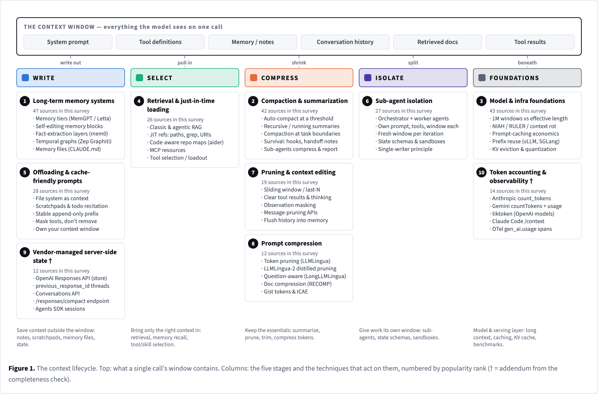
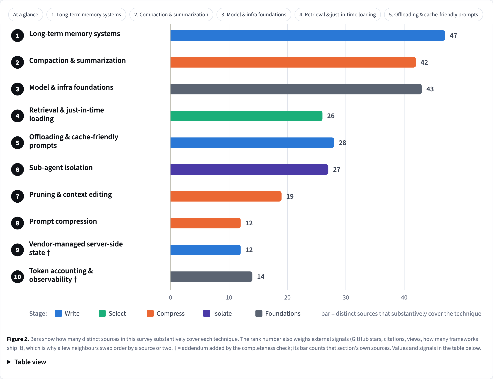
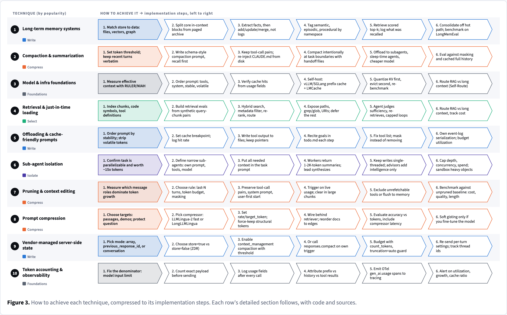
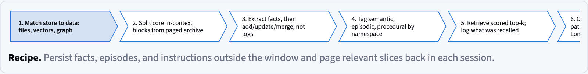

# Context Window Playbook — how people manage an LLM's context

**Reports:** [`report.html`](report.html) — the Context Window Playbook (techniques, 2026-08-20) · [`market-report.html`](market-report.html) — the Context Market Map (market research, 2026-08-21)

A sourced survey of the popular ways to manage an LLM's context window, ranked by how much the
literature and the community talk about them, each with a concrete implementation recipe, a code
snippet against a real API, tools, pitfalls and 12 sources.

## Deep dive: why context windows stop near 1M (added 2026-08-21)

A new section of `report.html` (nav: "★ Deep dive: context limits") answers: why frontier models cluster at ~1M tokens and why GPT-5 exposes 272K of input (400K window minus a 128K output reservation — verified on OpenAI's model page), the four bottlenecks (quadratic attention compute, linear KV-cache memory — e.g. ~328 GB per 1M tokens on Llama 3 70B — quality decay well before the nominal limit, and scarce long-context training data), how labs extend context (RoPE scaling, sparse/hybrid attention, MLA, training curricula), and what a distributed system can and cannot fix (context parallelism and disaggregated KV pools solve capacity; quality decay and per-token cost remain, so decomposition/retrieval/compaction stay necessary). Four figures: nominal-vs-effective context per model, cause→effect map, KV memory per 1M tokens vs GPU capacity, and an approach map by layer and maturity. Built from `src/deepdive/` (workflow `ctx-limits-deepdive`, 7 agents; sources verified via arXiv/Semantic Scholar APIs and WebFetch because the session's search quota was exhausted).

## Context Market Map (market research, 2026-08-21)

[`market-report.html`](market-report.html) answers three questions for a founder: what breaks for teams using context and memory tooling today and which of those problems are worth solving (14 scored problems), who the startups and incumbents are (24 profiled companies, 14 sourced funding rounds, 13 platform moves), and how a new entrant should pick a wedge (7 scored wedges, a recommended one, a first-90-days plan). Built by `src/market/build.py` from the `ctx-market-research` workflow outputs in `src/market/`; 195 sources. Known limitation: a session-wide search quota ran out mid-sweep, so some planned queries did not run (listed in the report's Method section).

## Findings at a glance

| # | Technique | Stage | Sources |
|---|---|---|---|
| 1 | Long-term memory systems (MemGPT/Letta tiers, mem0, Zep/Graphiti, memory files) | write | 47 |
| 2 | Compaction & summarization (auto-compact, running summaries, handoffs) | compress | 42 |
| 3 | Model & infra foundations (effective context, prompt caching, KV cache, benchmarks) | foundations | 43 |
| 4 | Retrieval & just-in-time loading (RAG, repo maps, MCP resources, tool loadout) | select | 26 |
| 5 | Offloading & cache-friendly prompts (file system as context, stable prefix) | write | 28 |
| 6 | Sub-agent isolation (orchestrator/workers, state schemas) | isolate | 27 |
| 7 | Pruning & context editing (sliding windows, tool-result clearing) | compress | 19 |
| 8 | Prompt compression (LLMLingua family, gisting) | compress | 12 |
| † | Addenda: vendor server-side state (OpenAI Responses/compact); token accounting & observability | | |

The report also maps the **open-source landscape**: 30 GitHub repositories (frameworks, tools, research
companions, curated lists) and 5 community threads, with live star counts, grouped by the technique each
implements (`src/repos.json`, fetched 2026-08-21).

Evidence base: 164 unique sources — 52 papers, 42 blog posts, 33 doc pages, 17 videos/talks,
9 community threads, 6 repos. Popularity = distinct sources that substantively cover a technique
(ranking also weighs stars, citations and how many frameworks ship it). Search was US-only and never
surfaced Reddit; community signal comes from Hacker News, X and GitHub.

## Figures

| Lifecycle map | Popularity |
|---|---|
|  |  |

| Recipe map (technique × implementation steps) | Decision flow |
|---|---|
|  |  |

## How it was made

`workflow.js` is the Claude Code `Workflow` script: 6 parallel source sweeps (papers, engineering
blogs, videos/talks, community, framework docs, model/infra) with hard search/fetch/time caps →
taxonomist (dedupe, cluster, rank) → one deep-read agent per technique writing an HTML fragment under
a strict contract plus a structured summary → completeness critic → ≤ 2 bounded gap-fills.
18 agents, 34 minutes, 0 errors. Every URL was present in a search result or fetched page; all links
were then audited (`src/links.tsv`: 147 live, 16 bot-blocked but confirmed, 1 dead and dropped).

## Rebuild

```bash
cd src
python3 build.py            # reads result.json, taxonomy.json, sections/, sweep/, links.tsv, decision.json, repos.json
cp llm-context-management.html ../report.html
# visual check (needs the Playwright workspace at ~/browser-automation):
NODE_PATH=~/browser-automation/node_modules node shoot.js llm-context-management.html ./shots
```

`build.py` generates every SVG figure programmatically (lifecycle map, popularity chart, recipe map,
per-section step rails, decision flow from `decision.json`). To re-run the research itself, edit the
`DIR` constant in `workflow.js` to a writable folder and run it through the Claude Code `Workflow` tool.
